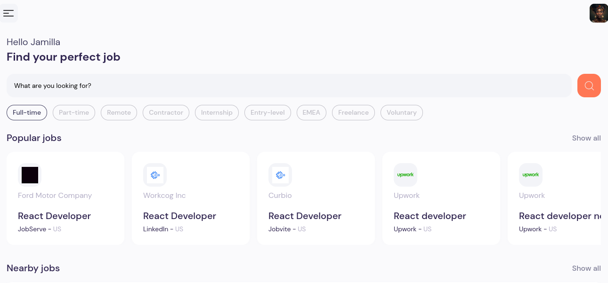
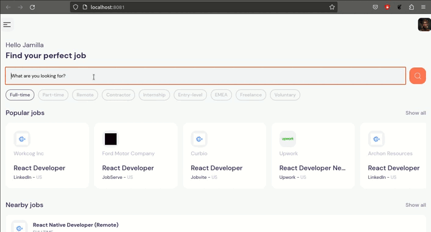

#  React Native Job Search App
This is a simple job search app built purely with React Native incorporating APIs for functionality.

The user simply searches for any type of job using a key word and it returns a list of job application links with a description.This is a multiplatform application it can work in Android, IoS and on any Web browser.

## Note
I used an API from [RapidApis website](https://rapidapi.com/hub) and the specific API is called [JSearch API](https://rapidapi.com/letscrape-6bRBa3QguO5/api/jsearch/)  you can create an account and utilise the API to generate your own keys for this project to work.


## Architechture
This is a simple web app so its high level architechure looks as the image below;


## Image and Video snipets of the app




This is a short video of how the application works;



## Future Improvements
Improvements that should be made include;

* Making the application multilingual.
* Every user having a personal account.
* Increase the functionality to allow in-app application of jobs.
* Include dark mode and light mode.

# Expo Router Example

Use [`expo-router`](https://expo.github.io/router) to build native navigation using files in the `app/` directory.

## 🚀 How to use

```sh
npx create-expo-app -e with-router
```

## 📝 Notes

- [Expo Router: Docs](https://expo.github.io/router)
- [Expo Router: Repo](https://github.com/expo/router)
